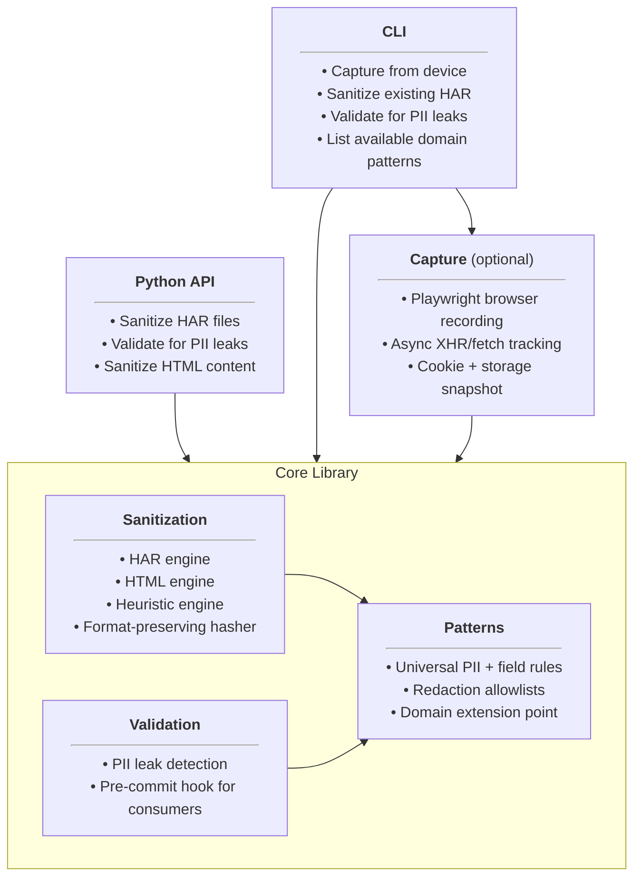
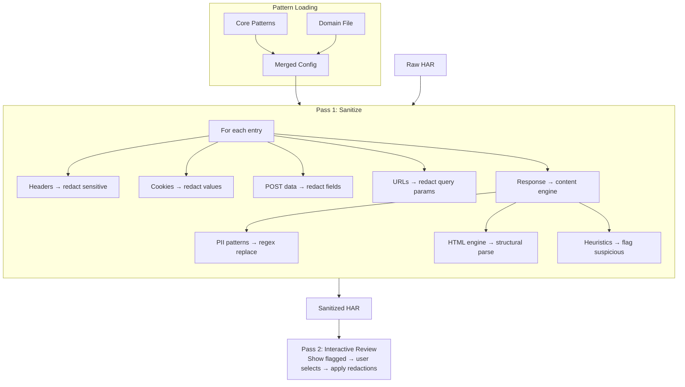

# Architecture

## What har-capture Is

har-capture is a **domain-agnostic** PII sanitization library for HAR files, with an optional browser capture layer and CLI.

The core library knows how to find and redact universal PII — MAC addresses, IP addresses, emails, passwords, session tokens, serial numbers. It has no knowledge of any particular device or application.

Domain-specific knowledge — what values are safe, what patterns indicate sensitive data in a particular product's web interface, how to parse vendor-specific HTML structures — lives in **domain pattern files** loaded at runtime and merged with core patterns. A consumer like cable_modem_monitor ships its own pattern file and gets domain-tuned sanitization without har-capture carrying any product-specific code.

## Design Constraints

1. **Domain-agnostic core.** Someone sanitizing a printer admin panel, an IoT hub, or a SaaS dashboard gets the same quality of sanitization — without carrying product-specific baggage.

1. **Extensible via data, not code.** Adding support for a new product category requires a JSON file, not code changes. Consumers bring their own domain knowledge through pattern files.

1. **Safe by default, tunable with domain knowledge.** Without domain patterns, the engine is conservative — it may flag more values for review. With domain patterns, it knows which values are safe and which HTML structures to scan, reducing noise.

1. **Correlation-preserving.** Redacted values use format-preserving salted hashes so the same MAC address always maps to the same placeholder within a session, preserving the ability to trace behavior across requests.

1. **PII never persists on disk unsanitized.** Raw captures go to temp files, get sanitized immediately, and the temp file is deleted. Even on crash, the raw HAR lives in `/tmp`, not the user's working directory.

## Capture Pipeline

### Phase 1: Browser Check

Verifies that Playwright is installed and the requested browser engine (chromium, firefox, or webkit) is available. If the browser executable is missing, the CLI prompts the user to download it (~150 MB one-time install). If system dependencies are missing (libasound, libnss3, libnspr4), the error is detected by pattern matching and the user is guided to install them.

### Phase 2: Connectivity Check

Determines whether the target is reachable and which HTTP scheme to use. Tries `http` then `https` (or user-specified scheme only). A 401/403 counts as "reachable." Self-signed certificates are accepted.

### Phase 3: Pre-Capture Probes

Three diagnostic probes (auth challenge, HEAD support, ICMP ping) gather metadata embedded in the final HAR as `_probes`.

### Phase 4: Auth Detection

Detects HTTP Basic Auth (401 + `WWW-Authenticate: Basic`) vs in-browser auth (form/HNAP). Basic Auth credentials are passed to Playwright's `http_credentials` context option; in-browser auth requires interactive mode.

See [Capture Spec](specs/CAPTURE_SPEC.md) for phase internals (connectivity detection, auth detection, probe details).

### Phase 5: Browser Capture

The core Playwright session. Key design decisions:

- **Temp file**: Raw HAR (containing PII) is written to `/tmp` via `mkstemp()`, never to the user's working directory
- **Embedded content**: Response bodies are base64-encoded within the HAR
- **Service worker blocking**: Prevents cached responses from interfering
- **HTTPS tolerance**: Self-signed/expired device certificates accepted

**Wait-for-data**: An init script monkey-patches `XMLHttpRequest.send` and `window.fetch` to track in-flight requests via `window.__harCapturePendingRequests`. After each navigation, the system polls this counter until 2 seconds of network silence (vs Playwright's 500ms `networkidle`). A `framenavigated` event listener ensures async data completes before page transitions.

**State capture**: After navigation, cookies (`context.cookies()`), localStorage (`context.storage_state()`), and sessionStorage (JS evaluation) are captured and injected into the HAR as `_har_capture` metadata.

**Error recovery**: Missing browser executables and system dependencies are detected by pattern matching, fixed automatically (reinstall), and retried once.

See [Capture Spec](specs/CAPTURE_SPEC.md) for full details (context config, wait-for-data mechanism, timing constants, timeout vs interactive mode).

### Phase 6: Post-Capture Processing

After the browser closes: metadata injection (probes, cookies, storage, tool version) → sanitization (Pass 1) → bloat filtering + deduplication → gzip compression → temp file cleanup.

The raw temp file is **always** deleted, ensuring PII doesn't persist on disk. See [Capture Spec](specs/CAPTURE_SPEC.md#post-capture-processing) for the full processing pipeline and file cleanup rules.

## Sanitization Pipeline

A HAR file flows through the system in two passes:

**Pass 1** auto-sanitizes each entry: headers, cookies, POST data, query strings, URL paths, then response content (MIME-dispatched to the HTML engine, JSON traversal, or string pattern matching).

**Pass 2** presents flagged values for interactive review (TTY) or writes them to a JSON report (CI/CD). User-selected redactions are applied via global find-and-replace using the same session salt.

See [Sanitization Spec](specs/SANITIZATION_SPEC.md) for the full entry point signatures, per-field logic, and two-pass model.

## How Domain Knowledge Plugs In

The pattern system is how har-capture stays domain-agnostic while supporting domain-specific sanitization. Core pattern files (`pii.json`, `sensitive.json`, `allowlist.json`) ship with the package and handle universal PII. Domain files (loaded via `--patterns`) add device-specific knowledge — safe values, heuristic detectors, HTML scanner config, additional PII patterns — and are merged on top of core at load time. Lists extend, dicts update.

This means a consumer like cable_modem_monitor ships its own pattern file and gets domain-tuned sanitization without har-capture carrying any modem-specific code. Consumers can layer multiple `--patterns` arguments for incremental customization.

See [Pattern Spec](specs/PATTERN_SPEC.md) for file schemas, merge semantics, and the loader/cache architecture.

## Functional Specs

Detailed specs for each subsystem:

| Spec                                            | Covers                                                                                     |
| ----------------------------------------------- | ------------------------------------------------------------------------------------------ |
| [Capture Spec](specs/CAPTURE_SPEC.md)           | Playwright session, wait-for-data, browser state, workflow phases, post-capture processing |
| [Sanitization Spec](specs/SANITIZATION_SPEC.md) | HAR/HTML/heuristic engines, two-pass model, scanner pipeline, format-preserving hasher     |
| [Pattern Spec](specs/PATTERN_SPEC.md)           | Pattern file schemas, domain files, merge order, loader/cache                              |
| [Validation Spec](specs/VALIDATION_SPEC.md)     | PII leak detection, check functions, redaction recognition, pre-commit hook                |
