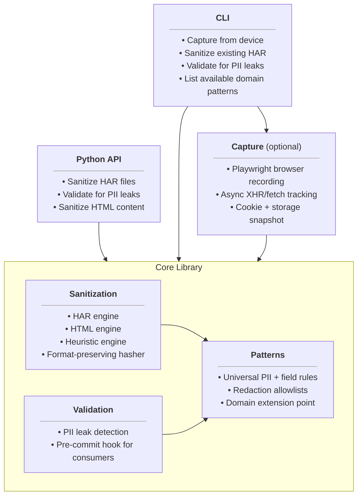
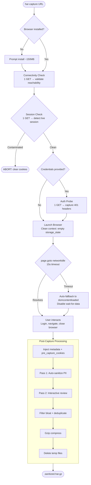
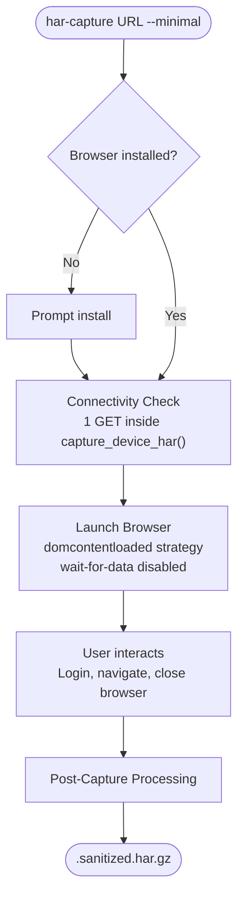
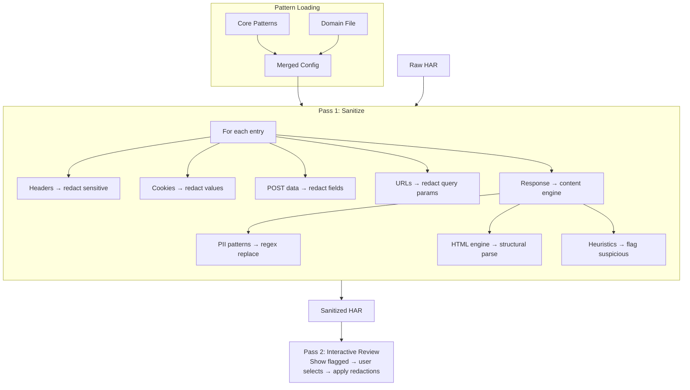

# Architecture

## What har-capture Is

har-capture is a **domain-agnostic** PII sanitization library for HAR files, with an optional browser capture layer and
CLI.



The core library knows how to find and redact universal PII — MAC addresses, IP addresses, emails, passwords, session
tokens, serial numbers. It has no knowledge of any particular device or application.

Domain-specific knowledge — what values are safe, what patterns indicate sensitive data in a particular product's web
interface, how to parse vendor-specific HTML structures — lives in **domain pattern files** loaded at runtime and merged
with core patterns. A consumer like cable_modem_monitor ships its own pattern file and gets domain-tuned sanitization
without har-capture carrying any product-specific code.

## Design Constraints

1. **Domain-agnostic core.** Someone sanitizing a printer admin panel, an IoT hub, or a SaaS dashboard gets the same
   quality of sanitization — without carrying product-specific baggage.

1. **Extensible via data, not code.** Adding support for a new product category requires a JSON file, not code changes.
   Consumers bring their own domain knowledge through pattern files.

1. **Safe by default, tunable with domain knowledge.** Without domain patterns, the engine is conservative — it may flag
   more values for review. With domain patterns, it knows which values are safe and which HTML structures to scan,
   reducing noise.

1. **Correlation-preserving.** Redacted values use format-preserving salted hashes so the same MAC address always maps
   to the same placeholder within a session, preserving the ability to trace behavior across requests.

1. **PII never persists on disk unsanitized.** Raw captures go to temp files, get sanitized immediately, and the temp
   file is deleted. Even on crash, the raw HAR lives in `/tmp`, not the user's working directory.

## Code Organization

The Design Constraints above govern *what* the system does. The principles below govern *where the logic lives*. They
are hard constraints — when in doubt, the principle wins over convenience.

1. **Separation of concerns is non-negotiable.** Each top-level package does one thing: `patterns/` loads and merges
   patterns; `sanitization/` removes PII; `capture/` records traffic; `validation/` checks results; `cli/` wires
   commands. No module reaches across package boundaries.

1. **DRY is non-negotiable.** Duplicated pattern loading, redaction checks, or detection logic are architecture bugs,
   not tech debt. If the same logic appears in 2+ places, extract a shared helper.

1. **The core library has no CLI dependency.** `cli/` is a thin wrapper over the library. API consumers
   (`sanitize_har_file()`, `validate_har()`, etc.) never import from `cli/`. If a CLI command requires non-trivial
   logic, the logic belongs in the library — the CLI invokes it.

1. **New features are additive.** Adding a domain pattern, heuristic detector, PII pattern, or scanner pass should be a
   new JSON file or registration, not a modification to existing code. If a feature requires editing unrelated modules,
   the abstraction is wrong.

The package layout that enforces this:

```text
src/har_capture/
├── patterns/      # Pattern loading, merging, redaction checking, hashing
│   └── domains/   # Built-in domain pattern files (network_device.json)
├── sanitization/  # HAR engine, HTML engine, heuristic engine
├── capture/       # Playwright recording, wait-for-data (optional dep)
├── validation/    # PII leak detection for pre-commit and CLI
└── cli/           # Typer commands (get, sanitize, validate, patterns)
```

## Capture Pipeline

Capture is user-driven: the user launches a browser, interacts with the target site naturally (login, navigate pages),
and closes the browser when done. har-capture records everything and sanitizes the result.

### Default Workflow

The default path minimizes pre-flight HTTP requests so the tool works with session-constrained devices (see
[ADR-2](ARCHITECTURE_DECISIONS.md#adr-2-minimal-pre-flight-in-interactive-mode)).



**Pre-flight HTTP requests:** 2 (no credentials) or 3 (with `--username`/`--password`).

### Workflow with `--minimal`

For devices that allow only one concurrent session (e.g., Compal CH7465MT), `--minimal` skips probes and auth detection,
defers the connectivity check into `capture_device_har()`, and uses a lenient page load strategy.



**Pre-flight HTTP requests:** 1 (connectivity check runs inside `capture_device_har()` rather than as a separate CLI
phase).

### Why Probes Are Not Default

Pre-capture probes (auth challenge, HEAD support, ICMP) capture metadata that Playwright would otherwise suppress when
`http_credentials` is set. In interactive mode without credentials, the browser handles auth dialogs natively and the
full HTTP exchange (including 401 responses) is recorded in the HAR. Probes auto-run only when the user provides
`--username`/`--password`, which triggers Playwright's `http_credentials` and suppresses the 401. See
[ADR-3](ARCHITECTURE_DECISIONS.md#adr-3-probes-are-opt-in-diagnostics).

### Browser Capture Detail

The core Playwright session. Key design decisions:

- **Clean context**: `storage_state={"cookies": [], "origins": []}` forces an empty cookie jar — no inherited session
  cookies or credentials
- **Temp file**: Raw HAR (containing PII) is written to `/tmp` via `mkstemp()`, never to the user's working directory
- **Embedded content**: Response bodies are base64-encoded within the HAR
- **Service worker blocking**: Prevents cached responses from interfering
- **HTTPS tolerance**: Self-signed/expired device certificates accepted

**Wait-for-data**: An init script monkey-patches `XMLHttpRequest.send` and `window.fetch` to track in-flight requests
via `window.__harCapturePendingRequests`. After each navigation, the system polls this counter until 2 seconds of
network silence (vs Playwright's 500ms `networkidle`). A `framenavigated` event listener ensures async data completes
before page transitions. Disabled in `--minimal` mode for devices with persistent connections.

**State capture**: After navigation, cookies (`context.cookies()`), localStorage (`context.storage_state()`), and
sessionStorage (JS evaluation) are captured and injected into the HAR as `_har_capture` metadata. Context-level browser
events that matter for downstream analysis are also surfaced under `_solentlabs`: `pre_capture_cookies` for
clean-session auditing, `popups` when the device opens a new page, and interactive JavaScript `dialogs` when a headed
user-driven capture resolves a native `alert` / `confirm` / `prompt` in the browser UI.

**Error recovery**: Missing browser executables and system dependencies are detected by pattern matching, fixed
automatically (reinstall), and retried once.

See [Capture Spec](specs/CAPTURE_SPEC.md) for full details (context config, wait-for-data mechanism, timing constants,
timeout vs interactive mode).

### Post-Capture Processing

After the browser closes: metadata injection (probes, cookies, storage, tool version, `_solentlabs.pre_capture_cookies`,
`_solentlabs.popups`, `_solentlabs.dialogs`) → sanitization (Pass 1) → interactive review (Pass 2) → bloat filtering +
deduplication → gzip compression → temp file cleanup.

The raw temp file is **always** deleted, ensuring PII doesn't persist on disk. See
[Capture Spec](specs/CAPTURE_SPEC.md#post-capture-processing) for the full processing pipeline and file cleanup rules.

## Sanitization Pipeline

A HAR file flows through the system in two passes:



**Pass 1** auto-sanitizes each entry: headers, cookies, POST data, query strings, URL paths, then response content
(MIME-dispatched to the HTML engine, JSON traversal, or string pattern matching).

**Pass 2** presents flagged values for interactive review (TTY) or writes them to a JSON report (CI/CD). User-selected
redactions are applied via global find-and-replace using the same session salt.

See [Sanitization Spec](specs/SANITIZATION_SPEC.md) for the full entry point signatures, per-field logic, and two-pass
model.

## How Domain Knowledge Plugs In

The pattern system is how har-capture stays domain-agnostic while supporting domain-specific sanitization. Core pattern
files (`pii.json`, `sensitive.json`, `allowlist.json`) ship with the package and handle universal PII. Domain files
(loaded via `--patterns`) add device-specific knowledge — safe values, heuristic detectors, HTML scanner config,
additional PII patterns — and are merged on top of core at load time. Lists extend, dicts update.

This means a consumer like cable_modem_monitor ships its own pattern file and gets domain-tuned sanitization without
har-capture carrying any modem-specific code. Consumers can layer multiple `--patterns` arguments for incremental
customization.

**Confidence boundary:** Domain `pii.patterns` entries run as Pass 0 auto-redaction — they must have 100% confidence
(zero false positives). Domain `heuristics.detectors` entries flag values for interactive review and can tolerate lower
confidence. When a domain-specific pattern cannot guarantee zero false positives, it belongs in `heuristics.detectors`,
not `pii.patterns`.

**Two extension points, one policy.** The file-based `--patterns` flow above is the *static* extension point: merge
happens once at load time and the merged set is cached. A *dynamic* extension point also exists for library callers that
only know their pattern list at runtime — `sanitize_post_data(..., custom_patterns=...)` and
`sanitize_html(..., custom_patterns=...)` accept the same dict schema and apply it as a per-call override via a
`ContextVar`. The ContextVar is read by `is_sensitive_field` / `is_flaggable_field` at every detection site, so
field-name extensions reach form params, JSON/XML bodies, and inline-script scanners without any signature plumbing. The
override is thread- and asyncio-scoped, additive to built-ins, and never mutates module state — independent callers with
different extensions do not observe each other's patterns. This is the mechanism cable_modem_monitor uses to pass
per-device credential field names (e.g. `pws`) without editing the universal `sensitive.json`.

See [Pattern Spec](specs/PATTERN_SPEC.md) for file schemas, merge semantics, and the loader/cache architecture;
[Sanitization Spec](specs/SANITIZATION_SPEC.md) for the ContextVar scope; and
[Custom Patterns Guide](CUSTOM_PATTERNS.md#extending-sensitive-field-detection) for the user-facing recipe.

## Functional Specs

Detailed specs for each subsystem:

| Spec                                            | Covers                                                                                     |
| ----------------------------------------------- | ------------------------------------------------------------------------------------------ |
| [Capture Spec](specs/CAPTURE_SPEC.md)           | Playwright session, wait-for-data, browser state, workflow phases, post-capture processing |
| [Sanitization Spec](specs/SANITIZATION_SPEC.md) | HAR/HTML/heuristic engines, two-pass model, scanner pipeline, format-preserving hasher     |
| [Pattern Spec](specs/PATTERN_SPEC.md)           | Pattern file schemas, domain files, merge order, loader/cache                              |
| [Validation Spec](specs/VALIDATION_SPEC.md)     | PII leak detection, check functions, redaction recognition, pre-commit hook                |
